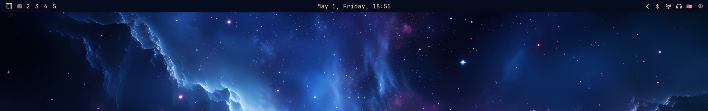
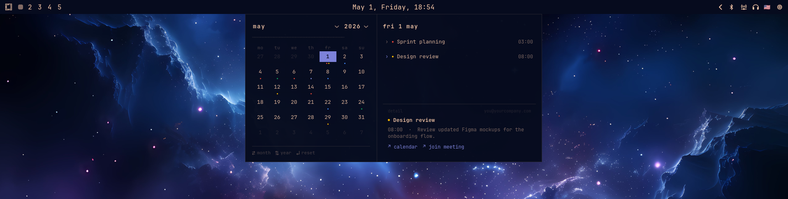

# waybar-calendar

A GTK4 calendar popup for [Waybar](https://github.com/Alexays/Waybar) with Google Calendar integration. Triggered by clicking the clock module. Supports multiple Google accounts, per-calendar colors, and follows your [omarchy](https://github.com/basecamp/omarchy) theme dynamically.

## Screenshots

<!-- screenshot: popup closed, waybar clock visible -->


<!-- screenshot: popup open showing calendar grid and events panel -->


## Features

- Month/year navigation via dropdowns or keyboard arrows
- Event dots on calendar days (up to 3, colored by calendar)
- Upcoming events panel with day-specific view on click
- Event detail card with description, Google Calendar link, and meeting link (Zoom/Meet)
- Dynamic theming from omarchy `colors.toml` — works with any theme
- Multiple Google accounts, each calendar retains its own color
- Atomic cache writes — no torn reads if sync runs while popup is open
- Systemd user service for background sync every 15 minutes

## Requirements

- [GJS](https://gitlab.gnome.org/GNOME/gjs) (GNOME JavaScript)
- GTK 4
- [gtk4-layer-shell](https://github.com/wmww/gtk4-layer-shell)
- Node.js 18+
- A Wayland compositor (Hyprland, Sway, etc.)

On Arch Linux:

```bash
sudo pacman -S gjs gtk4 gtk4-layer-shell nodejs npm
```

## Google Cloud Setup

You need to create your own OAuth 2.0 credentials. Google does not allow distributing credentials in open-source projects.

### 1. Create a project

1. Go to [Google Cloud Console](https://console.cloud.google.com/)
2. Create a new project (e.g. `waybar-calendar`)

### 2. Enable the Calendar API

1. Navigate to **APIs & Services → Library**
2. Search for **Google Calendar API** and enable it

### 3. Create OAuth credentials

1. Go to **APIs & Services → Credentials**
2. Click **Create Credentials → OAuth client ID**
3. Set application type to **Desktop app**
4. Name it anything (e.g. `waybar-calendar`)
5. Download the JSON file and save it somewhere safe, e.g.:
   ```
   ~/.config/waybar-calendar/credentials.json
   ```

### 4. Configure OAuth consent screen

1. Go to **APIs & Services → OAuth consent screen**
2. Set user type to **External**
3. Fill in the app name and your email
4. Under **Scopes**, add `https://www.googleapis.com/auth/calendar.readonly`
5. Under **Test users**, add every Google account you want to sync

> The app stays in "Testing" mode — you never need to publish it.

## Installation

```bash
git clone https://github.com/maxx306-hub/waybar-calendar.git ~/Projects/waybar-calendar
cd ~/Projects/waybar-calendar
npm install
npm run build
```

## Configuration

Create `~/.config/waybar-calendar/config.json`:

```json
{
  "credentialsPath": "/home/youruser/.config/waybar-calendar/credentials.json",
  "accounts": [
    { "id": "personal", "email": "you@gmail.com" },
    { "id": "work",     "email": "you@yourcompany.com" }
  ],
  "syncIntervalMinutes": 15
}
```

- `credentialsPath` — path to the OAuth credentials JSON downloaded from Google Cloud Console
- `accounts` — list of Google accounts to sync; `id` is an arbitrary local label
- `syncIntervalMinutes` — how often the background sync runs (default: 15)

## First run & authorization

Run a one-shot sync to trigger the OAuth flow for each account:

```bash
node ~/Projects/waybar-calendar/dist/sync.js --once
```

A browser window will open for each account. After authorizing, tokens are saved to `~/.config/waybar-calendar/token-<id>.json` and reused automatically.

Verify the output — it should report the number of events fetched:

```
[sync] Done. 87 events from 2 accounts.
```

## Waybar integration

Add `on-click` to your `custom/clock` module in `~/.config/waybar/config.jsonc`:

```jsonc
"custom/clock": {
  "exec": "date '+%B %-d, %A, %H:%M'",
  "interval": 10,
  "tooltip": false,
  "on-click": "$HOME/Projects/waybar-calendar/scripts/toggle.sh"
}
```

Click the clock to open/close the popup. Press **Escape** to close.

## Background sync (systemd)

Create `~/.config/systemd/user/waybar-calendar-sync.service`:

```ini
[Unit]
Description=Waybar Calendar Sync
After=network-online.target

[Service]
ExecStart=/usr/bin/node %h/Projects/waybar-calendar/dist/sync.js
Restart=on-failure

[Install]
WantedBy=default.target
```

Enable and start:

```bash
systemctl --user enable --now waybar-calendar-sync.service
```

## Keyboard shortcuts

| Key | Action |
|-----|--------|
| `←` / `→` | Previous / next month |
| `↑` / `↓` | Previous / next year |
| `Enter` | Reset to current month |
| `Escape` | Close popup |

## Project structure

```
popup/          GJS frontend (GTK4, runs as a persistent process)
src/            TypeScript sync daemon (Node.js, Google Calendar API)
dist/           Compiled JS output (generated by npm run build)
scripts/        Shell helpers (toggle.sh)
```

## License

MIT
